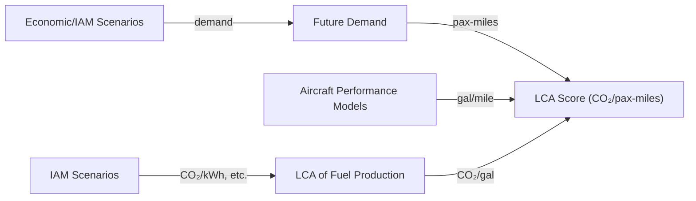
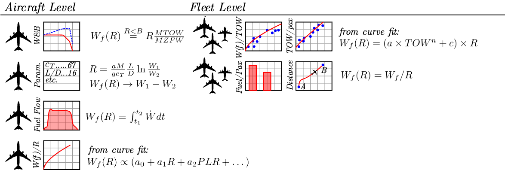
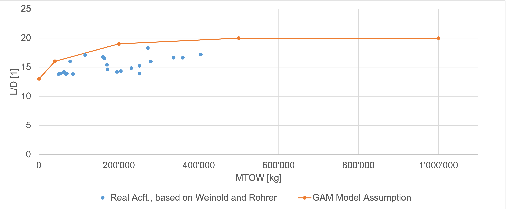

# Comparison

## Air Transport Emissions Models





| Model | Institution | Year | Functional Unit | LCA? | Source | License |
|-------|-------------|------|-----------------|------|--------|---------|
| [AIM](https://www.ucl.ac.uk/energy-models/models/aim) | UCL (used by MIT) | from 2006 | multiple | scores only? | [Project Site](https://www.atslab.org/data-tools/) | [MIT](https://mit-license.org) |
| [PSI (Cox et al.)](https://doi.org/10.1016/j.trd.2017.10.017) | PSI TAG | ~2018 | pax-km | yes | [Supplement](https://doi.org/10.1016/j.trd.2017.10.017) |  [CC BY NC 3.0](https://creativecommons.org/licenses/by-nc/3.0/deed.en) |
| [AeroMAPS](https://aeromaps.isae-supaero.fr) | ISAE-SUPAERO [ISA](https://isa-toulouse.com/) | from 2023 | ??? | yes | [GitHub](https://github.com/AeroMAPS/AeroMAPS) | [GPL-3.0](https://www.gnu.org/licenses/gpl-3.0.en.html) |
| [openLCA-AD]() | TUM | 2023 | pax-km | yes | ??? | [CC BY 4.0](https://creativecommons.org/licenses/by/4.0/deed.en) |

### Recent Literature Reviews

 - [Kaiser et al. (2023)](https://doi.org/10.1016/j.jairtraman.2023.102418)
 - [Table 1 in Sacchi et al. (2023)](https://doi.org/10.1038/s41467-023-39749-y)
 - [Table 2 in Planès et al. (2023)](https://doi.org/10.59490/joas.2023.7147)

## Datasets (Foreground Life-Cycle Inventory)

| Dataset | Institution | Year | Scope | Coverage | Source | License |
|---------|-------------|------|-------|----------|--------|---------|
| [Hybrid-Electric Aircraft (Thonemann et al.)](https://doi.org/10.1016/j.jclepro.2023.140314) | DTU and others | 2024 | ATR42-like 50 pax acft., range 200-600NM | airframe, powertrain, power electronics and drives, batteries, fuel cells, hydrogen onboard storage, airport infrastructure, battery charging stations | [Zenodo](https://doi.org/10.5281/zenodo.8155003) | [CC BY 4.0](https://creativecommons.org/licenses/by/4.0/deed.en) |

## Aircraft Models

| Dataset                                                                       | Institution   | Year | Scope                                | Coverage                                      | Source                                                        | License                                                                 |
|-------------------------------------------------------------------------------|---------------|------|--------------------------------------|-----------------------------------------------|---------------------------------------------------------------|-------------------------------------------------------------------------|
| [Hamelin et al. "Framework"](https://doi.org/10.1016/j.scitotenv.2023.163881) | INSA Toulouse | 2023 | Heart AS-19, A320, A350, BWB         | weights, range, fuel consumption (efficiency) | [Supplement](https://doi.org/10.1016/j.scitotenv.2023.163881) | All Rights Reserved                                                     |
| [GAM](https://doi.org/10.2514/6.2024-1707)                                    | ISAE          | 2023 | tube-and-wing acft.                  | weights (as fct. of range)                    | [GitLab](https://gitlab.com/m6029/genericairplanemodel)       | [CeCILL-C](http://www.cecill.info/licences/Licence_CeCILL-C_V1-en.html) |
| [Hydrogen Aircraft (McTighe et al.)]()                                        | PSI TAG       | 2024 | H2 only, Tube-and-wing, blended-wing | Weights, range, but top-down modeling         | ???                                                           | ???                                                                     |


### GAM (Generic Airplane Model)

The GAM model computes trip fuel (cruise only) from the Breguet range equation (cf. [Burzlaff et al. Eqn. (2.9)](https://www.fzt.haw-hamburg.de/pers/Scholz/arbeiten/TextBurzlaff.pdf)):

$$
R=\frac{V(L/D)}{cg}\text{ln}\big(\frac{m_1}{m_2}\big)
$$

which in [`generic_airplane_model.py#L566`](https://gitlab.com/m6029/genericairplanemodel/-/blob/main/models/generic_airplane_model.py?ref_type=heads#L566) they rearrange to compute the fuel burn for a given distance:

$$
m_f = m_1 (1 - e^{(-\frac{cgR}{V(L/D)})})
$$

Note that these functions are not documented in the code, or anywhere else. Good knowledge of basic aerodynamic equations is required to understand where they derive their functions from.

Curiously, the authors decided to solve the Breguet range equation with respect to $m_1=m_f+m_2$, which is the _takeoff mass_. This means that the package can _not_ be used to compute trip fuel if the takeoff mass is not known... which in my opinion defeats the purpose of a fuel calculation function.

Notably, the example provided in [`usecase.py#L30`](https://gitlab.com/m6029/genericairplanemodel/-/blob/main/models/usecase.py?ref_type=heads#L30) calculates trip fuel, but only after a takeoff weight is provided. I have no idea under what circumstances this would be useful:

```python
# ----- EXAMPLE OF AIRPLANE PERFORMANCE
tow = my_airplane['mtow']*0.9              # (kg) let us assume the airplane takes-off at 90% of its maximum mass
distance = 2000e3                          # (m) flight distance
cruise_speed = my_airplane['cruise_speed'] # (-) cruise Mach number (or True Airspeed (m/s) )
mtow = my_airplane['mtow']                 # (kg) Maximum Take-Off Weight

(...))

total_fuel_dict = gam.total_fuel(tow,distance,cruise_speed, mtow, total_power, power_system, altitude_data,reserve_data)
```

In addition, it is obvious that the model is, even by the author's admission

> (...) an extremely simplified procedure which relies on empirical regressions. \
> \- [GAM Readme](https://gitlab.com/m6029/genericairplanemodel/-/tree/main?ref_type=heads#principle)

Unfortunately, some of these regressions strike me as very poorly made. For instance, the model assumes in [`generic_airplane_model.py#L360`](https://gitlab.com/m6029/genericairplanemodel/-/blob/main/models/generic_airplane_model.py?ref_type=heads#L360) that L/D (aerodynamic efficiency) is a linear function of the maximum takeoff weight (MTOW):



I have my doubts if this is a good fit - much less a sound assumption of the undeying aerodynamical connection betwen MTOW and L/D. In any case, it is _very_ optimistic. An improvement in L/D of 3 is already very significant. Historically, such an improvement has taken >20 years of development.

### AIM2015

#### Air Traffic Model

Unlike all other models, AIM2015 models the impact of increasing prices on air travel demand directly (cf. [AIM2015 documentation, Section 3.1.1](https://www.atslab.org/wp-content/uploads/2023/02/AIM-2015-Documentation-v11.pdf)). Variables includes income elasticities, policy-driven price increases (EU ETS carbon pricing), electricity prices and their impact on H₂ production, etc.

#### Aircraft Performance Model

#### LCA

The model itself does not make use of life-cycle assessment of different fuel pathways. For instance, the `BiofuelDataByPathway.csv` file of the base model only ontains three emissions data columns:

```
Pathway_LC_gCO2MJ_excH2andElec_2020_Optimistic
Pathway_LC_gCH4MJ_excH2andElec_2020_Optimistic
Pathway_LC_gN2OMJ_excH2andElec_2020_Optimistic
```

In general, the treatment of life-cycle emissions upstream of fuel combustion are treated disparagingly:

> The lifecycle emissions of electricity from solar photovoltaics and wind are assumed to be zero (see Supplementary Section 1 for estimate on embedded emissions). While currently there are still embedded emissions in the production of photovoltaics modules and wind turbines, these are expected to approach zero with the decarbonization of the economy. \
> \- [Dray et al. (2023)](https://doi.org/10.1038/s41558-022-01485-4
), a recent publication that used the AIM2015 model

For climate impacts resulting from fuel combustion during flight, the model offers two options:

>  (...) For approximate calculations of different climate metrics, AIM’s Global Climate Model can be used (e.g. [Krammer et al. 2013](https://doi.org/10.1016/j.trd.2013.03.013)). For the recent paper by [Dray et al. (2022)](https://doi.org/10.1038/s41558-022-01485-4), AIM outputs were instead input to MIT’s APMT model. AIM can also output gridded inventories of fuel use, emissions and distance flown which can be used as input to full climate models. \
> \- [AIM2015 documentation, Section 3.5](https://www.atslab.org/wp-content/uploads/2023/02/AIM-2015-Documentation-v11.pdf))

## AeroMAPS

#### Air Traffic Model

#### Aircraft Performance Model

#### LCA

The primary user-facing function of the AeroMAPS model is `create_process`, as detailed in [`aeromaps/notebooks/examples_custom_process.ipynb`](https://github.com/AeroMAPS/AeroMAPS/blob/4bef13a4a10950283afcbf62ac1fcc36aae23805/aeromaps/notebooks/examples_custom_process.ipynb):

The [default `create_process` function](https://github.com/AeroMAPS/AeroMAPS/blob/4bef13a4a10950283afcbf62ac1fcc36aae23805/aeromaps/__init__.py#L6) loads a default model named `default_models_top_down`:

```python
def create_process(
    configuration_file=None,
    models=default_models_top_down,
    use_fleet_model=False,
    add_examples_aircraft_and_subcategory=True,
) -> AeroMAPSProcess:
```

[which in turn loads](https://github.com/AeroMAPS/AeroMAPS/blob/4bef13a4a10950283afcbf62ac1fcc36aae23805/aeromaps/core/models.py#L539)

```python
default_models_top_down = {
    (...)
    "models_energy_without_fuel_effect": models_energy_without_fuel_effect,
    (...)
}
```

[which in turn loads](https://github.com/AeroMAPS/AeroMAPS/blob/4bef13a4a10950283afcbf62ac1fcc36aae23805/aeromaps/core/models.py#L257)

```python
models_energy_without_fuel_effect = {
    (...)
    "biofuel_emission_factor": BiofuelEmissionFactor("biofuel_emission_factor"),
    "electricity_emission_factor": ElectricityEmissionFactor
    (...)
}
```

which in turn loads the [`models.air_transport.aircraft_energy.fuel_emissions.BiofuelEmissionFactor`](https://github.com/AeroMAPS/AeroMAPS/blob/4bef13a4a10950283afcbf62ac1fcc36aae23805/aeromaps/models/air_transport/aircraft_energy/fuel_emissions.py#L8) class, which loads/interpolates default CO₂ emission factors for biofuels from the data file [`aeromaps/resources/data/parameters.json`](https://github.com/AeroMAPS/AeroMAPS/blob/4bef13a4a10950283afcbf62ac1fcc36aae23805/aeromaps/resources/data/parameters.json#L310):

```
"biofuel_hefa_fog_emission_factor_reference_years_values": [20.7],
```

with associated metadata in [`aeromaps/resources/data/data_information.csv`](https://github.com/AeroMAPS/AeroMAPS/blob/4bef13a4a10950283afcbf62ac1fcc36aae23805/aeromaps/resources/data/data_information.csv#L34):

```
(...)
gCO2/MJ;
Emission factor of biofuel from HEFA pathway (from fats, oils and grease) for the reference years;
Statistical analysis of a literature review (see resources/energy_data)
```

# TODO

AIM2015 fuel consumption, based on gegression

