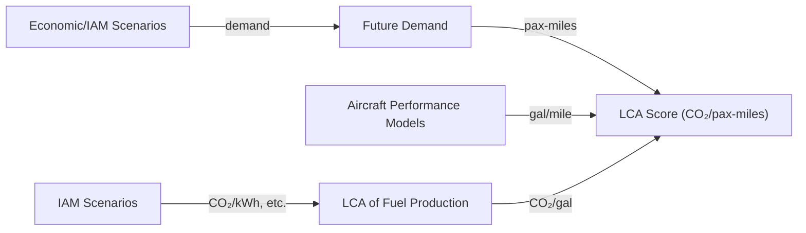

# Comparison

## Air Transport Emissions Models

| Model | Institution | Year | Functional Unit | LCA? | Source | License |
|-------|-------------|------|-----------------|------|--------|---------|
| [AIM](https://www.ucl.ac.uk/energy-models/models/aim) | UCL (used by MIT) | from 2006 | ??? | ??? | [Project Site](https://www.atslab.org/data-tools/) | [MIT](https://mit-license.org) |
| [PSI (Cox et al.)](https://doi.org/10.1016/j.trd.2017.10.017) | PSI TAG | ~2018 | pax-km | yes | [Supplement](https://doi.org/10.1016/j.trd.2017.10.017) |  [CC BY NC 3.0](https://creativecommons.org/licenses/by-nc/3.0/deed.en) |
| [AeroMAPS](https://aeromaps.isae-supaero.fr) | ISAE-SUPAERO [ISA](https://isa-toulouse.com/) | from 2023 | ??? | ??? | [GitHub](https://github.com/AeroMAPS/AeroMAPS) | [GPL-3.0](https://www.gnu.org/licenses/gpl-3.0.en.html) |
| [Hamelin et al. "Framework"](https://doi.org/10.1016/j.scitotenv.2023.163881) | INSA Toulouse | 2023 | ??? | ??? | [Supplement](https://doi.org/10.1016/j.scitotenv.2023.163881) | All Rights Reserved |
| [openLCA-AD]() | TUM | 2023 | pax-km | Yes | ??? | [CC BY 4.0](https://creativecommons.org/licenses/by/4.0/deed.en) |

Reviews

 - https://doi.org/10.1016/j.jairtraman.2023.102418



## Datasets (Foreground Life-Cycle Inventory)

| Dataset | Institution | Year | Scope | Coverage | Source | License |
|---------|-------------|------|-------|----------|--------|---------|
| [Hybrid-Electric Aircraft (Thonemann et al.)](https://doi.org/10.1016/j.jclepro.2023.140314) | DTU and others | 2024 | ATR42-like 50 pax acft., range 200-600NM | airframe, powertrain, power electronics and drives, batteries, fuel cells, hydrogen onboard storage, airport infrastructure, battery charging stations | [Zenodo](https://doi.org/10.5281/zenodo.8155003) | [CC BY 4.0](https://creativecommons.org/licenses/by/4.0/deed.en) |

## Aircraft Models

| Dataset | Institution | Year | Scope | Coverage | Source | License |
|---------|-------------|------|-------|----------|--------|---------|
| [Hamelin et al. "Framework"](https://doi.org/10.1016/j.scitotenv.2023.163881) | INSA Toulouse | 2023 | Heart AS-19, A320, A350, BWB | weights, range, fuel consumption (efficiency) | [Supplement](https://doi.org/10.1016/j.scitotenv.2023.163881) | All Rights Reserved |
| [GAM](https://doi.org/10.2514/6.2024-1707) | ISAE | 2023 | tube-and-wing acft. | weights (as fct. of range) | [GitLab](https://gitlab.com/m6029/genericairplanemodel) | [CeCILL-C](http://www.cecill.info/licences/Licence_CeCILL-C_V1-en.html) |
| [Hydrogen Aircraft (McTinghe et al.)]() | PSI TAG | 2024 | ??? | ??? | ??? | ??? |

### GAM (Generic Airplane Model)

The GAM model computes trip fuel (cruise only) from the Breguet range equation (cf. [Burzlaff et al. Eqn. (2.9)](https://www.fzt.haw-hamburg.de/pers/Scholz/arbeiten/TextBurzlaff.pdf)):

$
R=\frac{V(L/D)}{cg}\text{ln}\big(\frac{m_1}{m_2}\big)
$

which in [`generic_airplane_model.py#L566`](https://gitlab.com/m6029/genericairplanemodel/-/blob/main/models/generic_airplane_model.py?ref_type=heads#L566) they rearrange to compute the fuel burn for a given distance:

$
m_f = m_1 (1 - e^{(-\frac{cgR}{V(L/D)})})
$

Note that these functions are not documented in the code, or anywhere else. Good knowledge of basic aerodynamic equations is required to understand where they derive their functions from.

Curiously, the authors decided to solve the Breguet range equation with respect to $m_1=m_f+m_2$, which is the _takeoff mass_. This means that the package can _not_ be used to compute trip fuel if the takeoff mass is not known... which in my opinion defeats the purpose of a fuel calculation function.

Notably, the example provided in [`usecase.py#L30`](https://gitlab.com/m6029/genericairplanemodel/-/blob/main/models/usecase.py?ref_type=heads#L30) calculates trip fuel, but only after a takeoff weight is provided. I have no idea under what circumstances this would be useful:

```python
# ----- EXAMPLE OF AIRPLANE PERFORMANCE
tow = my_airplane['mtow']*0.9              # (kg) let us assume the airplane takes-off at 90% of its maximum mass
distance = 2000e3                          # (m) flight distance
cruise_speed = my_airplane['cruise_speed'] # (-) cruise Mach number (or True Airspeed (m/s) )
mtow = my_airplane['mtow']                 # (kg) Maximum Take-Off Weight

(...))

total_fuel_dict = gam.total_fuel(tow,distance,cruise_speed, mtow, total_power, power_system, altitude_data,reserve_data)
```

In addition, it is obvious that the model is, even by the author's admission

> (...) an extremely simplified procedure which relies on empirical regressions. \
> \- [GAM Readme](https://gitlab.com/m6029/genericairplanemodel/-/tree/main?ref_type=heads#principle)

Unfortunately, some of these regressions strike me as very poorly made. For instance, the model assumes in [`generic_airplane_model.py#L360`](https://gitlab.com/m6029/genericairplanemodel/-/blob/main/models/generic_airplane_model.py?ref_type=heads#L360) that L/D (aerodynamic efficiency) is a linear function of the maximum takeoff weight (MTOW):


I have my doubts if this is a good fit - much less a sound assumption of the undeying aerodynamical connection betwen MTOW and L/D. In any case, it is _very_ optimistic. An improvement in L/D of 3 is already very significant. Historically, such an improvement has taken >20 years of development.


AIM documentation: https://www.atslab.org/wp-content/uploads/2023/02/AIM-2015-Documentation-v11.pdf
https://web.jrc.ec.europa.eu/policy-model-inventory/explore/models/model-aim/